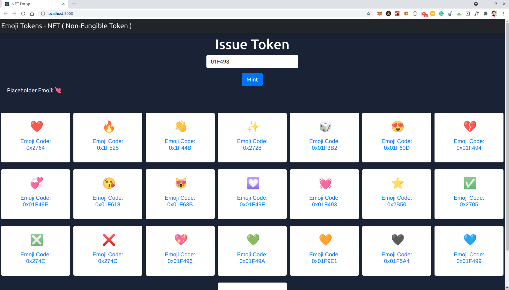

# Emoji Tokens DAPP - NFT (Non-Fungible Token)

#### Note: 
#####  Must have MetaMask Wallet
#####  Ues Rinkeby Testnet in MetaMask

[View Live Demo](https://emoji-token.herokuapp.com/)

# Getting Started with Create React App

This project was bootstrapped with [Create React App](https://github.com/facebook/create-react-app).

## Available Scripts

In the project directory, you can run:

### `truffle compile`

### `truffle deploy`

### `npm start`

Runs the app in the development mode.\
Open [http://localhost:3000](http://localhost:3000) to view it in the browser.

The page will reload if you make edits.\
You will also see any lint errors in the console.
